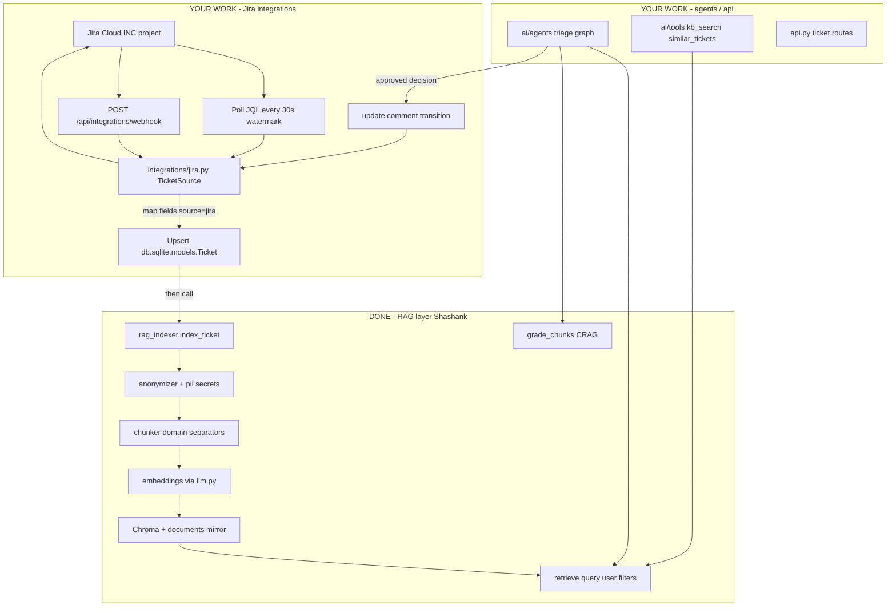

# TicketSphere — RAG Layer Handoff (for Claude / Jira + Agents teams)

**Owner (done):** Shashank · **Status:** RAG/data layer implemented · **Date:** 2026-08-07  
**Do not rebuild** what is listed as DONE. Fill the **YOUR WORK** sections only.

Related docs:
- Domain authority: `.cursor/BLUEPRINT.md` §7 (Jira), §3 (schemas), §5 (triage graph)
- RAG design: `.cursor/rag.md`
- Task checklist: `.cursor/plan.md`
- System pitch flow: `docs/FLOW.md` (scaffold language — this file is the live contract)

---

## 1. End-to-end flow (what exists vs what you build)



**Critical split of responsibility**

| Step | Who | Module |
|---|---|---|
| Fetch / poll / webhook from Jira | **Jira developer** | `backend/integrations/` + `api.py` |
| Upsert operational row `(source, external_id)` | **Jira developer** | `db.sqlite.models.Ticket` |
| Mask → chunk → embed → Chroma | **DONE** | `rag.rag_indexer.index_ticket` |
| Hybrid retrieve + CRAG grade | **DONE** | `rag.rag_retriever` |
| Triage graph / tools / sync gate | **Agents developer** | `ai/agents.py`, `ai/tools.py` |

`index_ticket()` **does not** write the SQLite `tickets` row. You must upsert `Ticket` (SQLAlchemy) yourself, then call `index_ticket` so precedent search works.

---

## 2. Contracts you must call (do not redeclare)

### 2.1 Index a Jira issue into the vector store

```python
from rag.rag_indexer import index_ticket
from rag.schemas import TicketIngestRequest
from db.sqlite.models import Ticket as TicketRow, SessionLocal

# 1) Upsert operational record (YOUR code)
row = TicketRow(
    external_id=issue_key,          # e.g. "INC-1234" or "INC0012345"
    source="jira",                  # REQUIRED for idempotency
    title=summary,
    body_masked=description,        # raw OK — index_ticket anonymizes again if anonymize=True
    application=service_name,
    environment="prod",
    channel="jira",
    status="new",
)
# unique on (source, external_id) — use merge / select-then-update

# 2) Index for RAG (DONE API)
result = index_ticket(
    {
        "external_id": issue_key,
        "source": "jira",
        "title": summary,
        "body": description,
        "application": service_name,
        "environment": "prod",
        "channel": "jira",
        "raw": {"team": inferred_team},   # optional hint
    },
    user_id=system_user_id,
    allowed_roles=[inferred_team, "manager", "admin"],  # stamps acl_<team>
    sensitivity="confidential",
    team=inferred_team,                 # ops | azure | aws | gcp
    service=service_name,
    category="",                        # fill after triage if you re-index
    severity="",
    anonymize=True,
)
# result = {"doc_id", "chunks", "status", "external_id", "doc_type": "ticket_history", ...}
```

Chroma metadata stamped on every chunk (filterable):

`doc_type=ticket_history`, `external_id`, `source`, `team`, `service`, `environment`,
`category`, `severity`, `resolved` (`"true"`/`"false"`), `acl_<team>`, `sensitivity`.

### 2.2 Retrieve (agents + chatbot)

```python
from rag.rag_retriever import retrieve, grade_chunks, build_context, to_citations

chunks = retrieve(
    query=ticket_text_or_question,   # first arg is named query (positional OK)
    user={"id": "...", "role": "engineer", "clearances": ["aws"]},
    summary="",                      # rolling chat summary if any
    filters={                        # optional Chroma equality filters
        "doc_type": "ticket_history",
        "team": "aws",
        "resolved": "true",
    },
    decompose=False,
    top_k=6,
    trace=trace,
)

# CRAG — agents own the re-retrieve loop; RAG only grades
from rag.schemas import GradeResult
graded: GradeResult = grade_chunks(query, chunks, trace=trace)
# graded.action in {"keep","filter","rewrite","none"}
# graded.chunks — possibly filtered
# graded.rewrite_query — if action=="rewrite", call retrieve() once more then stop
```

### 2.3 Pydantic shapes (import only — never copy)

```python
from rag.schemas import (
    Ticket,                 # anonymized domain record (Pydantic)
    TicketIngestRequest,    # inbound API/adapter payload
    TriageDecision,         # agent output
    TriageVerdict, SeverityVerdict, RoutingVerdict, DuplicateVerdict,
    OverrideRequest, TicketStats, ReflectionVerdict, GradeResult,
    RetrievedChunk, Citation,
)
```

### 2.4 SQLAlchemy models

```python
from db.sqlite.models import (
    Ticket as TicketRow,    # operational table — YOUR upsert target
    TriageRun,              # agents write one row per triage execution
    User, Document, SessionLocal, init_db,
)
```

**Name clash:** `rag.schemas.Ticket` ≠ `db.sqlite.models.Ticket`. Always alias the ORM as `TicketRow`.

---

## 3. Config / env already set for you

| Key | Value / meaning |
|---|---|
| `RETRIEVAL_MODE` | `hybrid` (BM25 + dense + RRF) |
| `EMBEDDING_MODEL` | `azure/genailab-maas-text-embedding-3-large` — **do not change without full reseed** |
| `TICKET_SOURCE` | `synthetic` today → set `jira` when adapter is live |
| `ROLES` | `admin`, `manager`, `engineer`, `viewer` |
| `TEAMS` | `ops`, `azure`, `aws`, `gcp` |

Files: `backend/config.py`, `backend/.env.example`.

Demo users (JWT must carry `role` + `clearances`):

| User | Password | Role | Clearances |
|---|---|---|---|
| admin | admin123 | admin | `["all"]` |
| manager | manager123 | manager | `["all"]` |
| ops1 | ops123 | engineer | `["ops"]` |
| azure1 | azure123 | engineer | `["azure"]` |
| aws1 | aws123 | engineer | `["aws"]` |
| gcp1 | gcp123 | engineer | `["gcp"]` |

ACL: team membership is **clearances → `acl_<team>`** Chroma keys. Manager/admin with `all` bypass filters. Sensitivity ceiling: manager/admin → restricted, engineer → confidential, viewer → internal.

---

## 4. Files changed (RAG DONE — do not rewrite)

```
backend/config.py
backend/.env.example
backend/rag/schemas.py          # Ticket, TriageDecision, verdicts, GradeResult
backend/rag/chunker.py          # ticket/runbook separators
backend/rag/anonymizer.py       # → Ticket; secret wipe; LLM_PASS_MIN_CHARS=120
backend/rag/rag_retriever.py    # retrieve(query=), grade_chunks, ACL drop log
backend/rag/rag_indexer.py      # index_ticket()
backend/rag/multimodal.py       # VISION_MODEL from settings only
backend/guardrails/pii.py       # AWS/Azure/JWT/PEM + domain IDs; INC/error codes safe
backend/guardrails/governance/access_control.py
backend/observability/evals.py  # EVAL_SET + run_retrieval_ab()
db/sqlite/models.py             # tickets, triage_runs, demo users
db/vectordb/seed_vector_db.py   # --generate corpus (run later; do not assume tickets/ present)
db/vectordb/data/seed/          # runbooks/policies OK; ticket JSON optional until seed phase
db/inspect_db.py                # previews tickets/triage_runs
docs/JUDGES_QA.md               # hybrid shipped; A/B table to fill after reseed
.cursor/plan.md                 # task checklist
.claude/plans/rag-handoff.md    # this file
```

**Out of RAG scope (your packages):**

```
backend/integrations/           # NEW — TicketSource, jira.py, synthetic.py
backend/api.py                  # poller schedule, webhook, ticket CRUD routes
backend/ai/agents.py            # triage graph calling retrieve/grade_chunks
backend/ai/tools.py             # kb_search, similar_tickets, ticket_update
```

---

## 5. YOUR WORK — Jira adapter (checklist)

Implement per `.cursor/BLUEPRINT.md` §7. Suggested layout:

```
backend/integrations/
  ticket_source.py    # ABC: fetch_since(watermark), update(), add_comment(), transition()
  jira.py             # REST v3, basic auth email:api_token, retry/backoff
  synthetic.py        # optional local fallback reading seed JSON
```

### Field mapping (Jira → our shapes)

| Jira | Our field |
|---|---|
| `key` (e.g. INC-42) | `external_id` + `source="jira"` |
| `fields.summary` | `title` |
| `fields.description` (ADF → plain text) | `body` / `body_masked` |
| custom *Triage Severity* | `severity` S1–S4 (after triage write-back) |
| custom *Priority Score* | `priority_score` |
| custom *Routed Team* | `assigned_team` |
| custom *AI Confidence* | `confidence` |
| labels / components | hint `application` / `service` / team |

### Idempotency & reliability (required)

1. Dedupe key = `(source="jira", external_id=issue.key)` — unique constraint already exists.
2. Poll watermark on `updated` / `updated_at`; never double-process on restart.
3. On sync failure: increment `TicketRow.sync_attempts`, set `last_error`, after 3 retries `status="failed"` (dead-letter).
4. Write-back only when decision is approved (or auto-approve S3/S4 + confidence ≥ 0.85) — enforce in `ai/tools.ticket_update`, not by skipping audit.
5. Prefer **poll primary**; webhook secondary (lab laptops often have no public URL). Demo webhook with `curl`.

### Suggested ingest sequence (one issue)

```
fetch issue
  → map to TicketIngestRequest / dict
  → upsert TicketRow (status=new)
  → index_ticket(...)                    # RAG DONE
  → (agents) run triage graph
  → write TriageRun row
  → update TicketRow fields + status
  → if approved: jira.update + add_comment(rationale+citations) + transition
  → audit.record(...)
```

### Env vars to add (in `config.py` only — no `os.getenv` elsewhere)

```
TICKET_SOURCE=jira
JIRA_BASE_URL=https://<site>.atlassian.net
JIRA_EMAIL=...
JIRA_API_TOKEN=...
JIRA_PROJECT_KEY=INC
JIRA_POLL_SECONDS=30
# optional customfield_xxxxx ids once site is provisioned
```

---

## 6. Seed corpus vs live Jira

> **Sequencing (locked):** Do **not** block basic flow on seeding.  
> Order: Jira ingest → upsert `TicketRow` → `index_ticket` → triage/`retrieve` works on live tickets → **then** generate + embed seed corpus + `run_retrieval_ab`.

> **Seed incidents are optional right now.** Sample ticket JSON under `db/vectordb/data/seed/tickets/` may be absent (intentionally cleared). That is fine — live Jira is the incident source during basic-flow development. Recreate synthetics only when you are ready to seed Chroma for the citation demo.

| Source | Purpose | When |
|---|---|---|
| Live Jira poll | Incidents for triage + `index_ticket` | **Now** |
| `seed_vector_db.py --generate` | Recreates 400 ticket JSON + 100 held-out gold rows + runbooks/SLA/catalogue | **After** basic flow works |
| `seed_vector_db.py --reset --generate` | Same + embed into Chroma | **After** gateway/embeddings available |
| `run_retrieval_ab()` | Hybrid vs vector numbers for JUDGES_QA | **Last** — needs seeded Chroma |

To wipe leftover ticket JSON (if any) and regenerate later:

```bash
# optional cleanup
Remove-Item -Recurse -Force db\vectordb\data\seed\tickets -ErrorAction SilentlyContinue

# when seeding for real (after basic flow)
pip install -r backend/requirements.txt
python db/vectordb/seed_vector_db.py --reset --generate
python db/inspect_db.py
```

Then retrieval A/B:

```python
from observability.evals import run_retrieval_ab
print(run_retrieval_ab())  # paste hit rates into docs/JUDGES_QA.md
```

---

## 7. Smoke checks after you wire Jira

1. Poll one issue → SQLite row `source=jira` → Chroma chunks with `doc_type=ticket_history`.
2. Login as `aws1` → `retrieve("INC…", user=aws1)` never returns `acl_ops`-only chunks.
3. Login as `manager` → sees all teams.
4. Planted `AKIA…` in description → masked at index; never in retrieve text.
5. `INC…` / `ORA-01555` still present in chunks (hybrid depends on them).
6. Unapproved S1 → `ticket_update` denied + audit `tool.denied`.

---

## 8. What Claude should NOT do

- Do not rename `retrieve`'s first arg back to `question`.
- Do not redeclare Pydantic models outside `rag/schemas.py`.
- Do not put Jira HTTP client inside `ai/llm.py` or `rag/` — keep `integrations/`.
- Do not change `EMBEDDING_MODEL` mid-build without `--reset` reseed.
- Do not filter ACL in the route after retrieve — ACL is inside Chroma `where` + `can_read`.
- Do not auto-close or auto-remediate in Jira; comment + field update + transition only after approval.

---

## 9. Quick import cheat-sheet

```python
# RAG (done)
from rag.rag_indexer import index_ticket
from rag.rag_retriever import retrieve, grade_chunks, build_context, to_citations
from rag.schemas import TicketIngestRequest, TriageDecision, GradeResult, RetrievedChunk

# ORM
from db.sqlite.models import Ticket as TicketRow, TriageRun, SessionLocal

# Config
from config import settings  # settings.TICKET_SOURCE, settings.TEAMS, settings.RETRIEVAL_MODE
```
